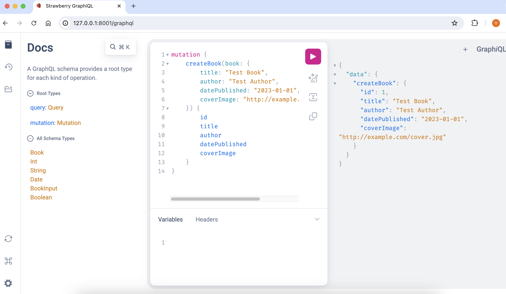

# swift-api-graphql

This project illustrates how one would go about implementing a GraphQL Web API in Python using FastAPI and Strawberry. 

This project was created by copying the [swift-api-rest](https://github.com/vkantchev/swift-api-rest) project and refactoring from REST to GraphQL. 

Currently for simplicity the database is just one table. However in a real world application there should probably be a separate table for Author and a BookAuthor table that links Books and Authors. See [Additional Considerations](https://github.com/vkantchev/swift-api-rest?tab=readme-ov-file#additional-considerations) in `swift-api-rest` for details.

## Run

```bash
source configure.sh

./watch.sh
```

Open the Graph<i>i</i>QL Explorer UI:

```bash
open http://127.0.0.1:8001/graphql
```



### Add a book

Paste this GraphQL code and click the `play` button:

```graphql
mutation {
    createBook(book: {
        title: "Test Book",
        author: "Test Author",
        datePublished: "2023-01-01",
        coverImage: "http://example.com/cover.jpg"
    }) {
        id
        title
        author
        datePublished
        coverImage
    }
}
```

### Query All Books

Paste this GraphQL code and click the `play` button:

```graphql
query {
    books {
        id
        title
        author
        datePublished
        coverImage
    }
}
```

## Updating the code

```bash
source configure.sh
```

Open the project directory in Visual Studio Code:

```bash
code .
```

## Development

Format it with the [black](https://black.readthedocs.io/en/stable/) formatter:

```sh
black .
```

Correct the import order with [isort](https://pycqa.github.io/isort/):

```sh
isort .
```

Verify the typing:

```sh
mypy src/
```

Run the tests (from the command line):

```sh
pytest
```

Generate test coverage report:

```bash
coverage run -m pytest && coverage combine && coverage report
```

Run tests in multiple python environments (will run for 3.12, 3.11, 3.10):

```sh
hatch run test
```

## Tasks

List tasks:

```bash
inv --list
```

## Run in Podman / Docker 

Rebuild container image and start container:

```bash
inv podman
```

Delete container and image:

```bash
inv podman-delete
```

## License

`swift-api-graphql` is distributed under the terms of the [Apache 2.0 ](https://spdx.org/licenses/Apache-2.0.html) license.
